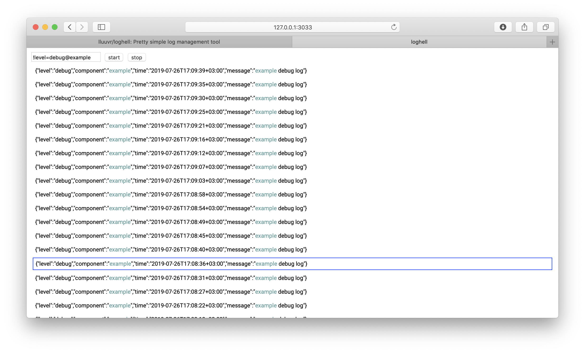

# loghell
Pretty simple log management tool. 
You can connect you app and view only logs that you need.

### Example


### [Example app](./example/)
### [Zerolog writer](./writer/zerolog.go)

### Docker usage
```bash
# up
docker-compose up -d --build

# down
docker-compose down
```

### Rule
##### Example
`!level=debug@example` - This rule takes logs with `level` field 
which contains `debug` word and highlight `example` word in all logs.

### Usage
```bash
Usage of loghell:
  -http int
    	set http server port (default 3033)
  -tcp int
    	set tcp server port (default 3031)
  -v	verbose output
  -ws int
    	set ws server port (default 3032)
    	
# start loghell
go run ./src/main.go
```
